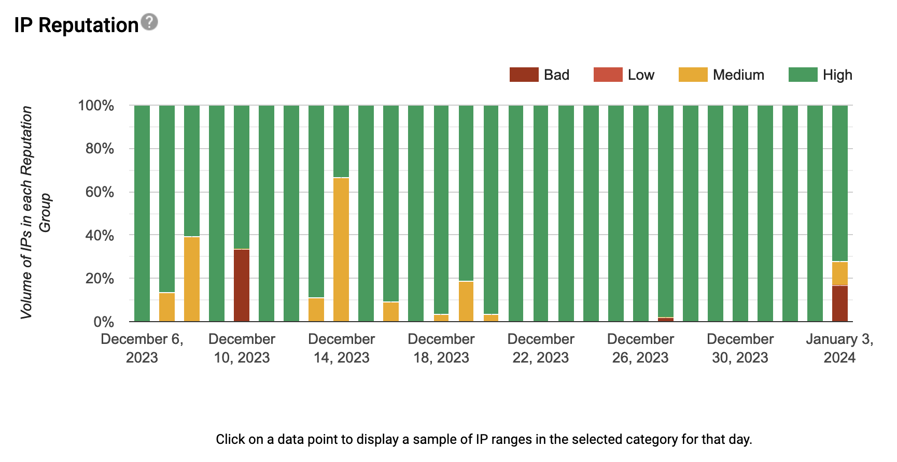
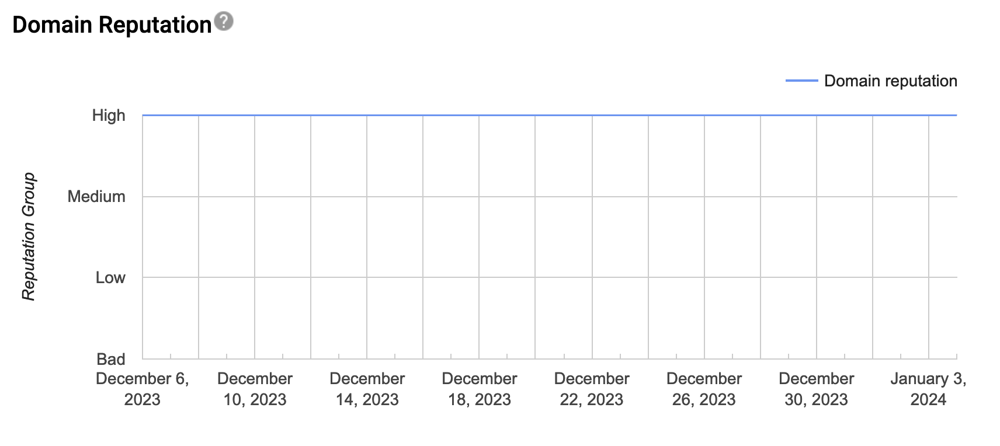
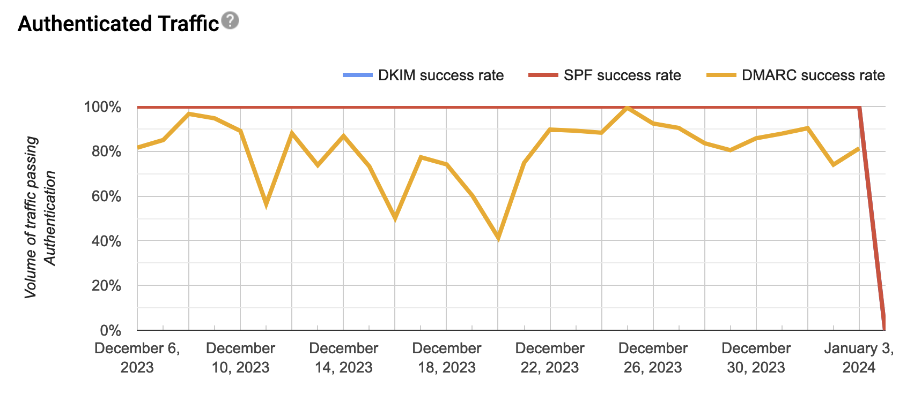
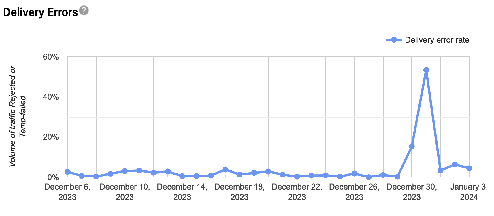

```admonish info
This site is a work in progress and will be updated regularly.  Please check back frequently for updates.
```

# Google's Postmaster Tools

Google’s Postmaster Tools serve as a valuable resource, enabling senders to troubleshoot and address deliverability issues. This tool provides crucial insights into key metrics, helping identify potential challenges in email sending practices.

According to Gmail, leveraging these tools allows for an assessment of the overall health of your email program. Even if Gmail is not your primary focus, gaining insights into how Gmail views your mail can enhance your understanding of your reputation across email platforms. Upon successful setup and activation, Google provides insights into various data points presented in distinct dashboards.

## Access and Setup

```admonish warning
Access to Postmaster Tools is reserved for technology professionals who administer `tamu.edu` email enabled subdomains.
```

1) Request access to the postmaster tools, by opening a ServiceNow ticket or email [security@tamu.edu](mailto:security@tamu.edu).  Please include the domain or list of domains that would like to be granted access.
2) Once access has been approved, your account will provisioned.
3) Start using the service by logging into [Postmaster Tools](https://postmaster.google.com).
   1) Upon logging in you will see an empty list.  You will need to add your requested domain(s) one at a time.
   2) Click the red '+' icon.  A new screen will appear on the website
   3) Under 'What domain do you use to authenticate your email?' type the domain name and click 'next'.  The domain will be added to the list.

```admonish warning
If it asks you to verify your domain, please send an email to [security@tamu.edu](mailto:security@tamu.edu) with the domain name to verify your access.
```

   4) If you would like to add an additional domain, click 'Add Domain'.
   5) When all domains have been added you can click 'Done'.  A list of domains should be displayed.
   6) Click the domain you’d like to review the Postmaster dashboards for.

```admonish info
Be sure to adjust the Dashboard and Date drop-downs depending on your report/search.
```

## Dashboards

```admonish note
There is a minimum daily email volume threshold for data to populate in the Google Postmaster Tools. Google doesn’t publish the specific threshold, but we’ve found that if you are sending over 100 messages per day to unique Gmail users, reputation data will be generated for that day.
```

Reports generated by Google update daily, providing insights into the prior day’s performance. All data is aggregated. Instead of giving you a score (for example, 0 to 100), Google gathers the results inside groups ranked from Bad to High.

### Spam Rate

The spam rate is the percentage of emails marked as spam by users vs emails sent to the inbox for active users. If a substantial number of emails are delivered directly to spam folders, you may see a low spam rate even though users may still be marking your inboxed emails as spam.


### IP Reputation

A higher IP reputation means emails sent from this IP are more likely to go to a recipient’s inbox instead of their spam folder. For example, if you send a lot of emails, and users mark them as spam, your IP reputation number will go down.

To reduce negative user feedback, you should regularly check your sending list. Be sure to only send emails to users who want your emails.



### Domain Reputation

A higher domain reputation means emails from your sending domain (SPF and DKIM) are less likely to get filtered to a recipient’s spam folder or inbox.



### Feedback Loop

This dashboard is available after you set up the Gmail Spam Feedback Loop (FBL). To view a table with the identifiers flagged by FBL and their corresponding spam rates, click any data point on the graph.

About FBL graphs:

- Average FBL spam rate graph: Shows average spam rate across all identifiers flagged by FBL on a given day (when applicable) over time.
- Identifier volume graph: Shows the number of unique identifiers flagged by FBL per day (when applicable) over time.


### Authentication

This dashboard shows the percentage of your emails that passed SPF, DKIM, and DMARC over all received traffic that attempted authentication.

About SPF, DKIM & DMARC graphs:

- SPF graph: Shows percentage of mail that passed SPF vs all mail from that domain that attempted SPF. This excludes any spoofed mail.
- DKIM graph: Shows percentage of mail that passed DKIM vs all mail from that domain that attempted DKIM.
- DMARC graph: Shows percentage of mail that passed DMARC alignment vs all mail received from the domain that passed either of SPF or DKIM.



### Encryption

This dashboard shows what percentage of your inbound and outbound traffic is encrypted.

About TLS inbound & outbound graphs:

- TLS Inbound: Shows percentage of incoming mail (to Gmail) that passed TLS vs all mail received from that domain.
- TLS Outbound: Shows percentage of outgoing mail (from Gmail) that was accepted over TLS vs all mail sent to that domain.


### Delivery Errors

This graph monitors what percentage of your total emails were rejected or temporarily failed as compared to all authenticated traffic. Under the graph, you can view a list of reasons an email failed.

About delivery errors:

- Rate limit exceeded: The Domain or IP is sending traffic at a suspiciously high rate and temporary rate limits have been put in place.
- Suspected spam: The traffic is suspected to be spam by our systems.
- Email content is possibly spammy: The traffic is suspected to be spammy specifically because of the content.
- Bad or unsupported attachment: Traffic contains attachments not supported by Gmail.
- DMARC policy of the sender domain: The sender domain has set up a DMARC rejection policy.
- Sending IP has a low reputation: The IP reputation of the sending IP is very low.
- Sending domain has a low reputation: The Domain reputation of the sending domain is very low.
- IP is in one or more public RBLs: The IP is listed in one or more public Real-time Blackhole Lists (RBLs). Work with the RBL to get your IP de-listed.
- Domain is in one or more public RBLs: The Domain is listed in one or more public Real-time Blackhole Lists. Work with the RBL to get your domain delisted.
- Bad or missing PTR record: The sending IP is missing a PTR record.



## FAQ

### What if I own multiple domains?

Multiple domains can be added to the postmaster tools, but data is displayed for only one domain at a time.  Domains must be added one domain at a time.

### Do these dashboards provide information on other email providers?

While these dashboards pertain only to email sent to Gmail recipients, the postmaster tools can give insights into your reputation across email platforms.

### Why are some or all of my dashboards empty? Why do I not see any data?

Most of the Postmaster Tools dashboards will only display data when there’s a sizable daily volume of email traffic (up to the order of hundreds) coming from your Authentication Domains and/or certain other conditions, in place to prevent abuse.  You may see a "No data to display" error message on the IP and Domain reputation dashboards. This may happen when your reputation is too low to show a value. To show data, some of the dashboards, like Spam Rate and Feedback Loop, need your emails to be authenticated by DKIM.

### How can I find more information on Google's Postmaster Tools?

For more information on postmaster tools see Google's [Postmaster Tools FAQ](https://support.google.com/a/answer/9983020?hl=en&ref_topic=6259779)
